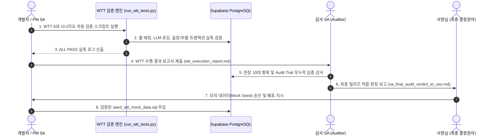

# Space Advisor 고유 WTT(통합 워크스루 테스트) 표준 운영 프로토콜

> **문서 코드**: `PROTO-WTT-001`  
> **적용 프로젝트**: Space Advisor (Space_consult_assist)  
> **표준 제정일**: 2026-08-23  
> **관리 주체**: PM SA & 감사 SA 공동 관리  
> **핵심 사명**: 헌장 I~X 전수 준수, 무음 실패(Zero Silent Failures) 원천 방어, 5대 전사 라이프사이클 100% 무결성 검증

---

## 1. WTT 5단계 표준 수행 절차 (5-Step Protocol)



---

## 2. 5대 필수 검증 시나리오 (Mandatory Scenario Matrix)

| 시나리오 ID | 검증 명칭 | 대상 모듈 | 필수 검증 포인트 |
|:---:|---|---|---|
| **S-1** | 표준 증상 룰 매칭 | `symptom_rules` | `pg_trgm` 유사도 검색, 1000ms 디바운스, 5단계 조치 스크립트 도출 |
| **S-2** | 미등록 증상 LLM Fallback | `llm_logs` | SHA-256 프롬프트 해시, 추론 소요시간(ms), `cache_hit`, 에러 무누락 기록 |
| **S-3** | 출장 배차 접수 & 이력 체인 | `visits`, `visit_status_history` | `client_type`('desktop'), `status`('접수'), `audit_log_minimal` 1:1 적재 |
| **S-4** | 모바일 정비 & 부품 재고 차감 | `parts`, `visit_parts` | `SELECT FOR UPDATE` 락, `parts.stock` 원자적 차감, 완료 알림톡 트리거 |
| **S-5** | 단순 영업 문의 분기 이관 | `sales_inquiries` | 견적/계약 문의 분기 격리, 출장 대장 오염 방지 (R&R 헌장 준수) |

---

## 3. 감사 SA 체크리스트 (Auditor Gate Requirements)

1. **무음 실패(Silent Failure) 원천 방어 (헌장 5.2)**:
   - DB 컬럼 누락이나 NOT NULL 제약 위반이 콘솔에서 삼켜지지 않고 명시적으로 예외 처리되어야 함.
2. **사건 기록의 무누락 DB 저장 (헌장 1.2)**:
   - 상태가 변경될 때마다 `visit_status_history` 체인과 `audit_log_minimal`이 1:1 동기 저장되어야 함.
3. **부품 재고 실시간 원자적 차감 (헌장 4.1)**:
   - 부품 사용 등록 시 `parts.stock`이 즉시 차감되어 일할 정합성이 유지되어야 함.
4. **부서 R&R 엄격 분리 (헌장 2.1)**:
   - 영업 문의와 출장 AS가 각각 독립된 테이블로 격리 저장되어야 함.

---

## 4. WTT 실행 및 검증 자동화 도구

- **테스트 러너**: `backend/scripts/run_wtt_tests.py`
- **모의 데이터 생성기**: `backend/scripts/generate_wtt_mock_sql.py`
- **모의 데이터 배포본**: `backend/scripts/seed_wtt_mock_data.sql`
- **실행 명령**:
  ```bash
  python backend/scripts/run_wtt_tests.py
  ```
